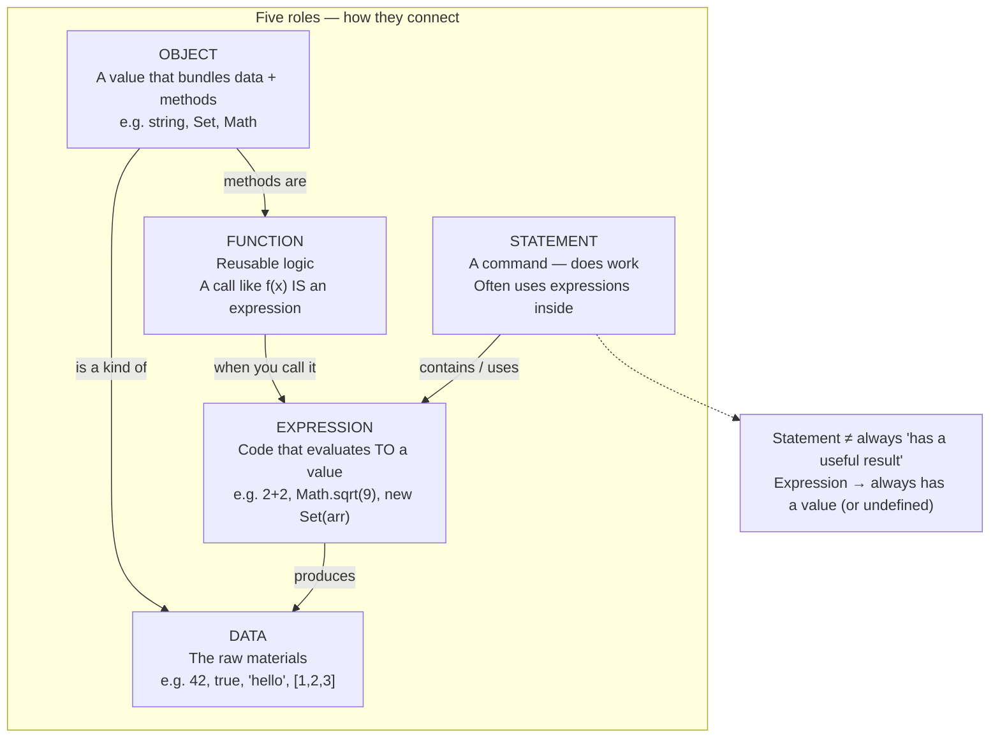
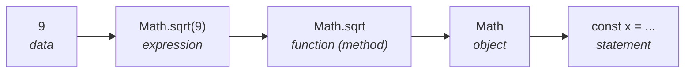
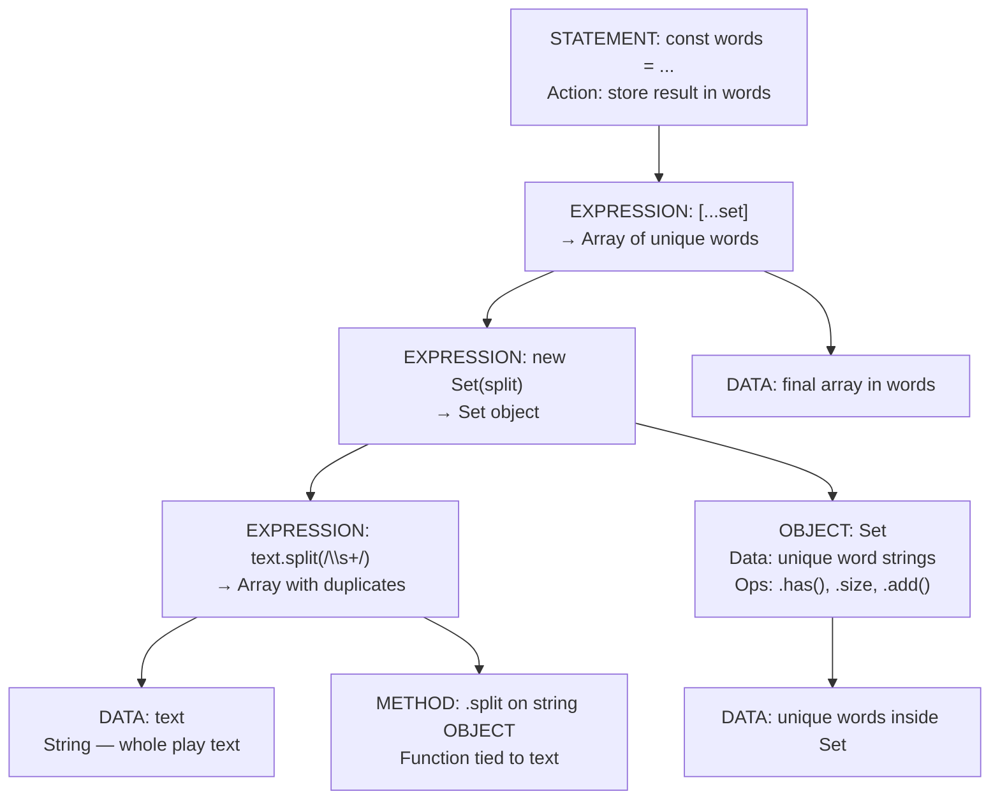

# CS61A 1.1 — Concept Map: Data, Expression, Function, Object, Statement

**Not strict nesting** — these are **roles** that connect. Use the flowchart for general thinking; use the “one line” peel for reading a single statement.

---

## 1. Role map (main diagram)



**Arrows in plain English:**

| From | To | Meaning |
|------|-----|---------|
| Expression | Data | Running the expression **gives you** a value |
| Statement | Expression | Statements **use** expressions (especially on the right of `=`) |
| Function call | Expression | `Math.sqrt(9)` is an expression whose value is `3` |
| Object | Data | An object **is** a value sitting in memory |
| Object | Function | `.split`, `.has`, `.sqrt` are **functions attached** to that object (methods) |

---

## 2. Reading one line inside → out (optional lens)

Good for: `const x = Math.sqrt(9);` — **not** “every program layer must exist.”



Peel order: **data → expression → function call → object that owns the method → whole line is a statement.**

---

## 3. Shakespeare line — all roles on one statement

```javascript
const words = [...new Set(text.split(/\s+/))];
```



**Set does NOT hold `text`.** It holds **unique word strings** after `split` already chopped the string.

---

## 4. Quick reference card

| Concept | One sentence | Test question |
|---------|--------------|---------------|
| **Data** | Stuff the program works with | What value ended up in memory? |
| **Expression** | Asks “what is this?” → gets a value | Would the REPL print a result? |
| **Function** | Named reusable computation | Can I call it again with different inputs? |
| **Object** | Data + tools bundled together | What methods does this value have? |
| **Statement** | Tells the computer to **do** something | Is it mainly an action, not a value to reuse? |

---

## 5. Nested-box diagram vs this map

| Teaching nested boxes | This role map |
|----------------------|---------------|
| Looks like Object ⊃ Function ⊃ Expression ⊃ Data always | **Relationships** — not always all layers |
| Easy to read one line | Also works for lines with no object (`const n = 5`) |
| Can imply “text lives inside Set” | Set holds **words from split**, not the whole string |

---

## 6. Agent loop tie-in (optional)

From `learn-claude-code-typescript/agents/s01_agent_loop.ts`:

| Piece | Role |
|-------|------|
| `query` (user string) | **Data** |
| `client.messages.create(...)` | **Expression-like** — input → model output value |
| `history.push({ role, content })` | **Statement** — record turn |
| `history` array | **Object/data** — conversation context (not Set-deduped queries) |

KV / prompt cache = inference optimization, **not** the Shakespeare `Set` dedup pattern.
