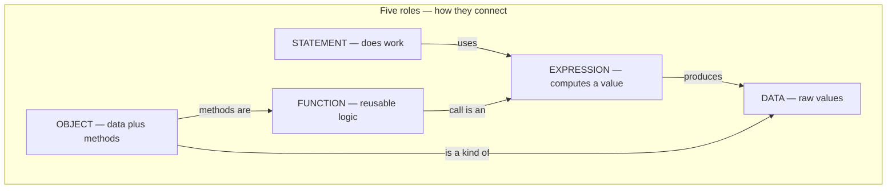
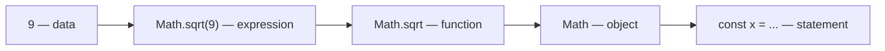
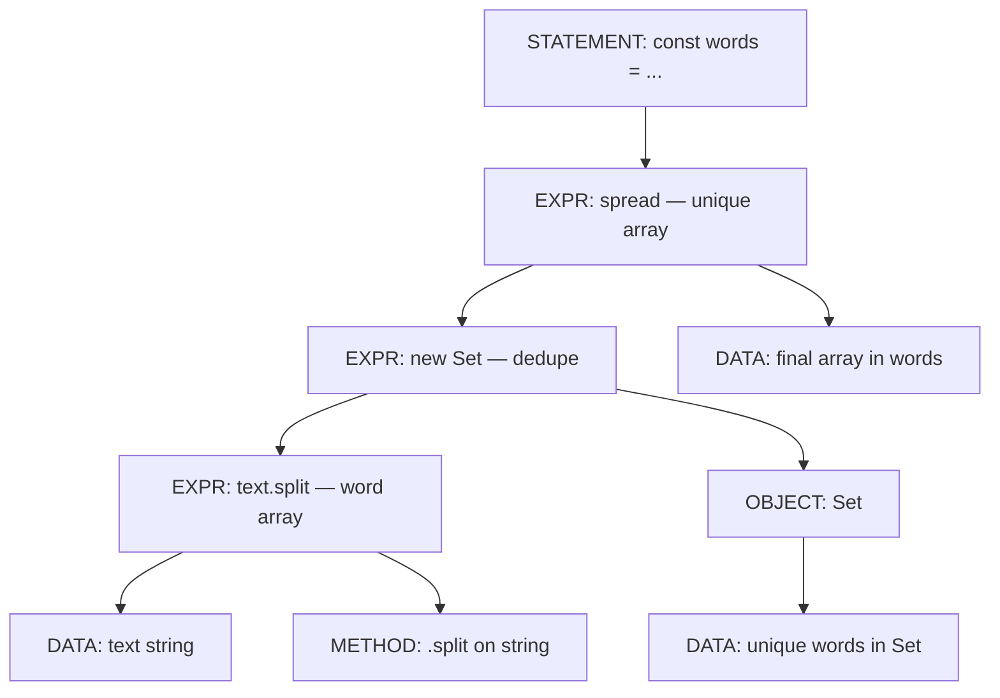
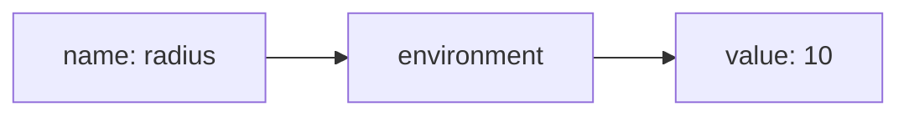
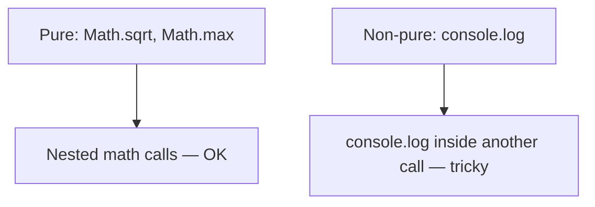

# CS61A Concept Map — 1.1 Getting Started & 1.2 Elements of Programming

Use the **Big Picture** trees for orientation, **Nodes** for teaching flow, and **Mermaid** diagrams for relationships. Details live in tables (preview-friendly — no HTML in diagram labels).

---

# Part 1 — 1.1 Getting Started

## 1.1 Big Picture

Section 1.1 introduces how to talk to JavaScript and how to read code. Ideas build in this order:

```text
Why languages exist (precision)
         │
         ├──→ REPL (Read → Eval → Print → Loop)
         │
         ├──→ Expressions vs Statements
         │         │
         │         └──→ Five roles: Data → Expression → Function → Object → Statement
         │
         ├──→ Functions (encapsulation) — Math.sqrt vending machine
         │
         ├──→ Objects (data + methods) — string, Set, Shakespeare line
         │
         ├──→ typeof (operator, not a function)
         │
         └──→ Three error types (syntax / runtime / semantic)
```

---

### Node 1: Why programming languages exist

Natural language is ambiguous; programming languages trade richness for **one clear meaning** per expression.

| Idea | Plain English |
|------|----------------|
| Precision | The computer does exactly what you wrote — no guessing |
| Grammar | Syntax rules, like sentence structure in English |

**Check-in:** Why can't we just tell the computer "fix my code" in plain English?

---

### Node 2: The REPL cycle

```text
Read (Enter) → Eval → Print → Loop ↺
```

| Mode | Prompt | Use |
|------|--------|-----|
| **REPL** | `>` | Try one expression at a time; see values |
| **Shell + file** | `➜` | Run whole file: `node path/to/file.js` |

**Mistake to avoid:** Typing `node myfile.js` **inside** the REPL — that is JavaScript code, not a shell command. Exit with `.exit` first.

---

### Node 3: Expressions vs statements

| | Expression | Statement |
|---|------------|-----------|
| Job | Compute a **value** | **Do** something |
| REPL | Usually prints result | Often no useful result |
| Examples | `2 + 2`, `typeof 42`, `Math.sqrt(144)` | `const x = 5`, `console.log("hi")` |

One line can be **both**:

```javascript
const area = Math.PI * 5 * 5;
//  ^statement          ^expression (right side)
```

**Analogy:** Expression = question with an answer. Statement = command ("store this", "print that").

---

### Node 4: Five roles (not strict nesting)

These are **roles**, not boxes inside boxes.



| Role | Examples |
|------|----------|
| **DATA** | `42`, `true`, `"hello"`, `[1, 2, 3]` |
| **EXPRESSION** | `2 + 2`, `Math.sqrt(9)`, `new Set(arr)` |
| **FUNCTION** | `Math.sqrt`, `text.split` |
| **OBJECT** | `"hello"`, `Set`, `Math` |
| **STATEMENT** | `const x = 5`, `console.log("hi")` |

**One-line peel** (`const x = Math.sqrt(9);`):



---

### Node 5: Functions — encapsulated logic

**Analogy:** Vending machine — input → hidden process → output.

```text
144 ──→ Math.sqrt ──→ 12
```

You do not need to know the square-root algorithm. **Encapsulation** = hide complexity behind a simple name.

| Term | Note |
|------|------|
| `Math.sqrt` | Function value (can assign: `const g = Math.sqrt`) |
| `Math.PI` | **Property** (stored value), not a method — no `()` |

---

### Node 6: Objects — data + methods

**Analogy:** Swiss Army knife — tools bundled with the thing they work on.

```javascript
"hello".toUpperCase();
"hello".length;
```

---

### Node 7: Shakespeare line (expressions inside one statement)

```javascript
const words = [...new Set(text.split(/\s+/))];
```



| Step | What happens |
|------|----------------|
| `text` | String — whole text |
| `text.split(/\s+/)` | Array of words (duplicates OK) |
| `new Set(...)` | Set — **unique words only** (not the whole `text` string) |
| `[...set]` | Array again for later code |
| `const words = ...` | Statement — store result |

**Production use of dedupe:** vocabulary lists, tags, search terms, log summaries — when you need **distinct** items, not every repeat.

---

### Node 8: `typeof` — operator, not function

```javascript
typeof 42;       // preferred style
typeof(42);      // same — parens are grouping only
```

```javascript
const f = typeof;      // SyntaxError — operators are not values
const g = Math.sqrt;   // OK — functions are values
```

---

### Node 9: Three error types

| Type | When | Example |
|------|------|---------|
| **Syntax** | Before run | `function f( {` — broken grammar |
| **Runtime** | During run | `consolle.log("hi")` — name not found |
| **Semantic** | Never caught | `f - 32 * 5 / 9` — runs, wrong answer |

---

### 1.1 Quick reference

| Concept | One sentence |
|---------|----------------|
| **Data** | Stuff the program works with |
| **Expression** | Code that evaluates to a value |
| **Function** | Reusable computation |
| **Object** | Data + methods bundled |
| **Statement** | Command that does work |

---

# Part 2 — 1.2 Elements of Programming

*Builds on 1.1: expressions, functions, statements. Adds names, environments, evaluation order, pure vs non-pure.*

## 1.2 Big Picture

```text
Three language mechanisms
         │
         ├──→ Primitive expressions (42, true, "hello")
         │
         ├──→ Means of combination ──→ Call expressions ──→ Nested expression trees
         │
         └──→ Means of abstraction ──→ Names (const / let) ──→ Environment
                                                                │
                                                                ▼
                                                     Pure vs non-pure functions
```

**Lego analogy:**

| Mechanism | Lego | Code |
|-----------|------|------|
| **Primitives** | Single bricks | `42`, `"hi"`, `true` |
| **Combination** | Snap bricks together | `2 + 3`, `Math.max(1, 2)` |
| **Abstraction** | Label an assembly "door frame" | `const radius = 10` |

---

### Node 1: Three mechanisms — check-in (1.1 Shakespeare line)

```javascript
const words = [...new Set(text.split(/\s+/))];
```

| Mechanism | Parts in that line |
|-----------|-------------------|
| **Primitives** | `text`, string literals, regex `/\s+/` |
| **Combination** | `text.split(...)`, `new Set(...)`, `[...]` |
| **Abstraction** | `const words = ...` — name for the whole result |

---

### Node 2: Primitive and compound expressions

| Kind | Examples | Result |
|------|----------|--------|
| Number | `42` | `42` |
| Arithmetic | `1/2 + 1/4 + ...` | a number |
| Comparison | `3 > 2`, `5 === 5` | `true` / `false` |
| Logical | `true && false`, `!true` | boolean |

**Infix:** operator between operands (`2 + 3`). **Call:** function name before parens (`Math.max(3, 7)`).

---

### Node 3: Call expressions

```javascript
Math.max(7.5, 9.5);   // operator: Math.max, operands: 7.5, 9.5 → 9.5
```

| Part | Meaning |
|------|---------|
| **Operator (callee)** | The function: `Math.max` |
| **Operands (arguments)** | Values passed in: `7.5`, `9.5` |
| **Return value** | What the call produces: `9.5` |

**Why call notation matters:** many arguments, clear nesting, one uniform style.

```javascript
Math.max(Math.min(1, -2), Math.min(Math.pow(3, 5), -4));
```

---

### Node 4: Names, bindings, and the environment

```javascript
const radius = 10;
const area = Math.PI * radius * radius;
```

| Term | Meaning |
|------|---------|
| **Binding** | Name linked to a value |
| **Environment** | Memory of all name → value links |
| **const** | Binding should not change |
| **let** | Binding may change (`let x = 2; x = x + 1`) |

**Functions as values:**

```javascript
const f = Math.max;
f(2, 3, 4);   // 4
```

**Important:** `const area = ...` using `radius` does **not** auto-update when `radius` changes later — you need a new assignment to refresh `area`.



---

### Node 5: Evaluating nested expressions (expression tree)

```javascript
Math.pow(2, 1 + 10) - Math.pow(2, 5);   // 2016
```

**Procedure (call expressions):**

1. Evaluate the **operator** (which function).
2. Evaluate **arguments** left to right (each may be its own subexpression).
3. **Apply** the function to those values.

```text
         (-)
        /   \
     pow    pow
     / \    / \
    2  (+)  2   5
      / \
     1  10
```

| Node kind | Examples |
|-----------|----------|
| **Leaves** | numerals `42`, names `radius` (looked up in environment) |
| **Interior** | call expressions and their results |

**Names need context:** `add(x, 1)` is meaningless without an environment that defines `add` and `x`.

**Statements vs expressions (again):** `const x = 3` is **executed**, not evaluated for a useful value.

---

### Node 6: Pure vs non-pure functions

| | Pure | Non-pure |
|---|------|----------|
| **Returns** | A useful value | May return `undefined` |
| **Side effects** | None | Yes (e.g. printing) |
| **Same args** | Same result every time | May differ if state changes |
| **Example** | `Math.sqrt(16)` → `4` | `console.log(1, 2, 3)` prints, returns `undefined` |

```javascript
const two = console.log(2);   // prints 2; two is undefined — bad for assignment
```

**Why prefer pure functions:** reliable nesting, easier tests, safer concurrency.



---

### Node 7: 1.2 practice exercises map

| Exercise | Concept |
|----------|---------|
| 1 | Call expression — `Math.max(3, 7, 1)` |
| 2 | Names + environment — `circumference = 2 * pi * 10` |
| 3 | Nested expressions — `Math.pow(2 + 3, 4 - 1)` |
| 4 | `typeof` on string and boolean |
| 5 | Pure function — `typeof Math.sqrt(16) === "number"` |

---

### 1.2 Quick reference

| Concept | One sentence |
|---------|----------------|
| **Primitive** | Simplest expression forms the language gives you |
| **Combination** | Build bigger expressions from smaller ones |
| **Abstraction** | Name a compound thing and reuse the name |
| **Call expression** | Apply a function to arguments |
| **Environment** | Where name lookups happen |
| **Expression tree** | Picture of evaluate-inside-first order |
| **Pure function** | Value only, no side effects |
| **Non-pure function** | May change state or print; often returns `undefined` |

---

## Bridge: 1.1 → 1.2 → your agent loop

| 1.1 idea | 1.2 extends it | Agent (`s01_agent_loop.ts`) |
|----------|----------------|-----------------------------|
| Expression vs statement | Statements executed; expressions evaluated | `history.push` = statement; model call ≈ expression |
| Function as value | `const f = Math.max` | Tools and callbacks later |
| Environment | Names store context | `history` array holds conversation bindings |
| Pure vs non-pure | Prefer pure for composition | Model text = value; tool run = side effect |

KV / prompt cache = inference speed for repeated prefixes — **not** the Shakespeare `Set` dedup pattern.
