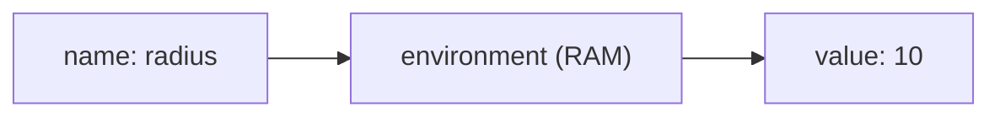
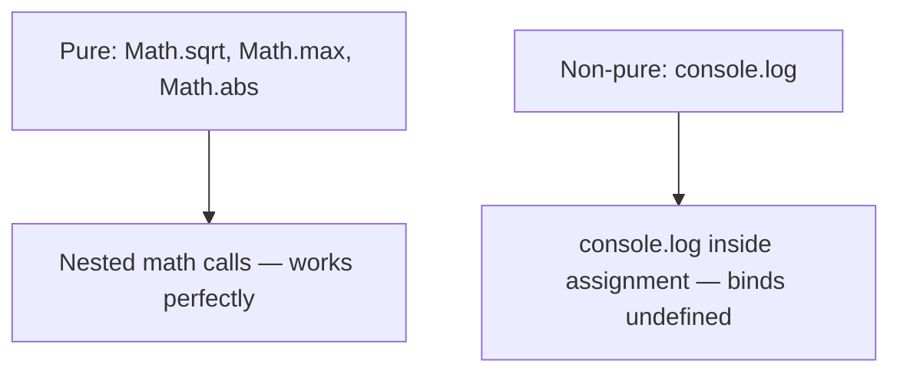

# CS61A Concept Map — 1.2 Elements of Programming

Use the **Big Picture** trees for orientation, **Nodes** for teaching flow, and **Mermaid** diagrams for relationships. Details live in tables (preview-friendly — no HTML in diagram labels).

---

## 1.2 Big Picture

Section 1.2 builds on 1.1 (expressions, functions, statements) and adds names, environments, evaluation order, and pure vs non-pure.

```text
Three language mechanisms
         │
         ├──→ Primitive expressions (42, true, "hello")
         │
         ├──→ Means of combination ──→ Call expressions ──→ Nested expression trees
         │
         └──→ Means of abstraction ──→ Names (const / let) ──→ Environment
                                                                │
                                                                ▼
                                                     Pure vs non-pure functions
```

**Lego analogy:**

| Mechanism | Lego | Code |
|-----------|------|------|
| **Primitives** | Single bricks | `42`, `"hi"`, `true` |
| **Combination** | Snap bricks together | `2 + 3`, `Math.max(1, 2)` |
| **Abstraction** | Label an assembly "door frame" | `const radius = 10` |

---

### Node 1: Three mechanisms of a language

Every powerful language provides three things. Applied to the Shakespeare line from 1.1:

```javascript
const words = [...new Set(text.split(/\s+/))];
```

| Mechanism | Parts in that line |
|-----------|-------------------|
| **Primitives** | `text`, string literals, regex `/\s+/` |
| **Combination** | `text.split(...)`, `new Set(...)`, `[...]` |
| **Abstraction** | `const words = ...` — name for the whole result |

---

### Node 2: Call expressions

```javascript
Math.max(7.5, 9.5);   // operator: Math.max, operands: 7.5, 9.5 → 9.5
```

| Part | Meaning |
|------|---------|
| **Operator (callee)** | The function: `Math.max` |
| **Operands (arguments)** | Values passed in: `7.5`, `9.5` |
| **Return value** | What the call produces: `9.5` |

**Three advantages over infix notation:**

| Advantage | Example |
|-----------|---------|
| Arbitrary number of arguments | `Math.max(1, -2, 3, -4)` |
| Nesting is explicit in parens | `Math.max(Math.min(1, -2), 3)` |
| All math notation unifies | `add(3, 4)` instead of `3 + 4` |

---

### Node 3: Nested call expressions — tracing the tree

```javascript
Math.max(Math.min(1, -2), Math.min(Math.pow(3, 5), -4));   // → -2
```

```text
                 Math.max
                /        \
          Math.min      Math.min
          /     \       /       \
         1     -2   Math.pow   -4
                    /       \
                   3         5

→ pow(3,5)=243  → min(243,-4)=-4
→ min(1,-2)=-2
→ max(-2, -4) = -2
```

**Evaluation rule:** evaluate operator → evaluate operands left-to-right → apply. Recursive — stops at primitives.

---

### Node 4: Names, bindings, and the environment

```javascript
const radius = 10;
const area = Math.PI * radius * radius;
```



| Term | Meaning |
|------|---------|
| **Binding** | Name linked to a value |
| **Environment** | Memory of all name → value links (in RAM, dies with process) |
| **const** | Binding should not change — default choice |
| **let** | Binding may change — only when mutation is needed |

**Functions as values:**

```javascript
const f = Math.max;
f(2, 3, 4);   // 4
```

**Snapshot, not a live link:**

```javascript
let r = 10;
let a = Math.PI * r * r;   // a = 314.15...
r = 11;
// a is STILL 314.15... — does not auto-recalculate
```

**Destructuring swap:**

```javascript
let a = 3, b = 4.5;
[a, b] = [b, a];           // a=4.5, b=3 — idiomatic JS swap
```

| Syntax | Works? | Why |
|--------|--------|-----|
| `a, b = b, a` | No | Comma operator, not destructuring |
| `[a, b] = [b, a]` | Yes | Clean, idiomatic |
| `({a, b} = {b, a})` | Yes | Needs parens (bare `{` = code block) |

---

### Node 5: Expression trees — the evaluation procedure

```javascript
Math.pow(2, 1 + 10) - Math.pow(2, 5);   // 2016
```

```text
         (-)
        /   \
     pow    pow
     / \    / \
    2  (+)  2   5
      / \
     1  10
```

**Procedure (for call expressions):**

1. Evaluate the **operator** (which function).
2. Evaluate **arguments** left to right (each may recurse).
3. **Apply** the function to those values.

| Node kind | Examples |
|-----------|----------|
| **Leaves** | numerals `42`, names `radius` (looked up in environment) |
| **Interior** | call expressions and their results |

**Names need context:** `add(x, 1)` is meaningless without an environment that defines `add` and `x`.

**Statements vs expressions:** `const x = 3` is **executed** (not evaluated) — it does not produce a value.

---

### Node 6: Pure vs non-pure functions

| | Pure | Non-pure |
|---|------|----------|
| **Returns** | A useful value | May return `undefined` |
| **Side effects** | None | Yes (e.g. printing) |
| **Same args** | Same result every time | May differ if state changes |
| **Example** | `Math.sqrt(16)` → `4` | `console.log(1, 2, 3)` prints, returns `undefined` |

```javascript
console.log(console.log(1), console.log(2));
// 1                  ← side effect of inner log
// 2                  ← side effect of inner log
// undefined undefined ← outer log receives (undefined, undefined)
```



**The trap:** `const two = console.log(2)` — prints 2 (side effect), binds `undefined` to `two`. Use `const two = 2` instead.

**Why prefer pure functions:** reliable nesting, easier tests, safer concurrency.

---

### Node 7: Environment — memory layers

| Concept | What it is | Persists? |
|---------|-----------|-----------|
| **Environment** | Interpreter's software data structure (name → value) | Dies when program exits |
| **RAM** | Hardware — where the environment lives during execution | Cleared on power off |
| **CPU cache** | Hardware — tiny fast memory between CPU and RAM | Not relevant here |
| **Hard disk** | Hardware — permanent file storage | Persists after power off |

**One-line summary:** The environment is the interpreter's in-memory notebook. Close the interpreter, the notebook disappears.

---

### 1.2 Quick reference

| Concept | One sentence |
|---------|----------------|
| **Primitive** | Simplest expression forms the language gives you |
| **Combination** | Build bigger expressions from smaller ones |
| **Abstraction** | Name a compound thing and reuse the name |
| **Call expression** | Apply a function to arguments: operator + operands |
| **Environment** | Where name lookups happen — in-memory, dies with process |
| **Expression tree** | Picture of evaluate-inside-first order |
| **Pure function** | Value only, no side effects, same args → same result |
| **Non-pure function** | May change state or print; often returns `undefined` |

---

## Bridge: 1.1 → 1.2 → your agent loop

| 1.1 idea | 1.2 extends it | Agent (`s01_agent_loop.ts`) |
|----------|----------------|-----------------------------|
| Expression vs statement | Statements executed; expressions evaluated | `history.push` = statement; model call ≈ expression |
| Function as value | `const f = Math.max` | Tools and callbacks later |
| Environment | Names store context | `history` array holds conversation bindings |
| Pure vs non-pure | Prefer pure for composition | Model text = value; tool run = side effect |

KV / prompt cache = inference speed for repeated prefixes — **not** the Shakespeare `Set` dedup pattern.
