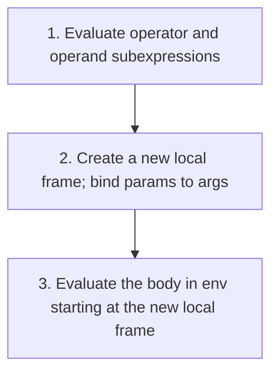

# CS61A Concept Map — 1.3 Defining New Functions

Use the **Big Picture** tree for orientation, the **Nodes** for teaching flow, and the **ASCII frame diagrams** + **Mermaid** for relationships. Details live in tables (preview-friendly — no HTML in diagram labels).

Section 1.3 extends 1.2's *name → value* bindings to *name → compound operation*. The new engine under everything: **each call spawns a fresh local frame.**

---

## 1.3 Big Picture

```text
Function Definitions (name → compound operation)
         │
         ├──→ Environments = sequence of frames
         │         ├── Global frame  (shared board — everyone sees it)
         │         └── Local frame   (one per call — holds the parameters)
         │
         ├──→ Calling a user-defined function (3 steps)
         │         1. Evaluate operator & operands
         │         2. Create local frame, bind params to args
         │         3. Evaluate body (look up names: local → global)
         │
         ├──→ Scope — params are LOCAL to the body; a wall sits between frames
         │
         ├──→ Pass by value — the argument's VALUE is copied onto a fresh name tag
         │
         ├──→ Composition — one function calling another → multiple frames alive at once
         │
         └──→ Functions as abstractions — described by domain, range, intent (not implementation)
```

**Kitchen analogy** (extends the 1.2 Lego/kitchen idea — a cook, a ticket, a station):

| Concept | Kitchen | Code |
|---------|---------|------|
| **Global frame** | Recipe board on the wall — every cook reads it | top-level `function` / `const` / built-ins (`Math`) |
| **Local frame** | A cook's order ticket + prep station | bindings created per call, destroyed on `return` |
| **Formal parameter** | A blank line on the ticket | `x`, `radius`, `name` |
| **Calling a function** | A cook shouts an order; a fresh ticket appears | `square(5)` |
| **Argument** | The number shouted across | the `5` in `square(5)` |
| **`return`** | Dish goes out; ticket torn up, station cleared | frame destroyed |
| **Scope** | A cook reads own ticket + wall board — never another cook's ticket | look up local frame first, then global |

---

### Node 1: Function definitions — naming a compound operation

```javascript
function square(x) {
  return x * x;
}
```

| Part | Meaning |
|------|---------|
| **`square`** | Name bound to the function — lives in the global frame |
| **`x`** | Formal parameter — a placeholder, no value yet |
| **`return x * x`** | Body — NOT evaluated until the function is called |

Defining a function just **tapes the name to the board**. Nothing runs yet. Contrast with 1.2: `const radius = 10` bound a name to a *value*; here we bind a name to a *process*.

User-defined functions are used identically to built-ins — looking at `sumSquares(x, y)`, you cannot tell whether `square` is built-in, imported, or user-defined.

**Rebinding names:** a name that held a function can be overwritten (`g = 2`), but then calling it throws `TypeError: g is not a function`.

---

### Node 2: Environments — global + local frames

An **environment** is a sequence of **frames**. Each frame holds **bindings** (name → value). There is one **global frame**; each call creates a fresh **local frame**.

```text
Global Frame                              ← the wall board
  square       -> func square(x)
  sumSquares   -> func sumSquares(x, y)
  Math         -> (built-in object)

square() frame  [f1]                      ← a fresh ticket, created on call
  x -> 5
```

Each function is represented by its intrinsic name + formal parameters. The name bound in a frame is what drives lookup; the intrinsic name is informational only.

---

### Node 3: Calling a user-defined function — the procedure

When the interpreter evaluates a call to a user-defined function, it runs three steps:



Trace `square(-2)`:

```text
1. square defined  →  Global: square -> func square(x)

2. square(-2) called  →  new local frame f1:  x -> -2

3. body `x * x` evaluated:
     look up x → found in f1 as -2
     (-2) * (-2) = 4
   return 4  →  f1 destroyed
```

---

### Node 4: Name lookup — local frame first, then global

**Rule:** a name evaluates to the value bound in the *earliest (innermost)* frame where it is found. Local frames are checked **before** the global frame.

```text
   Math.PI * square(radius)
   ────       ──────  ──────
     │           │       └─ radius → f1? YES → 10          (LOCAL)
     │           └─ square → f1? no → global? YES → func   (GLOBAL)
     └─ Math → f1? no → global? YES → Math object          (GLOBAL)
```

A single body can pull names from **both** frames in one expression — `radius` from local, `Math` and `square` from global.

---

### Node 5: Scope & local names — the wall between frames

The parameter name inside a function is **local** to that function's body. Different frames can bind the same name (`x`) to different values without interference — there is a **wall** between local frames.

```text
              ┌─────────────────────────────────────────┐
              │   GLOBAL FRAME   (recipe board on wall)  │
              │       square  ->  func square(x)         │
              │       cube    ->  func cube(x)           │
              └─────────────────────────────────────────┘
                       ▲                       ▲
                       │  both look UP here    │  both look UP here
                       │                       │
 ┌─────────────────────┴────────┐   ┌──────────┴──────────────────┐
 │  f1  ·  cube's frame         │   │  f2  ·  square's frame      │
 │        x  ->  3              │   │        x  ->  3             │
 └──────────────────────────────┘   └─────────────────────────────┘
            │   ✗ these two boxes CANNOT see each other
            │           value 3
            └──────────  passed  ───────────────┘
                       (cube shouts "3!")
```

Trace `cube(3)` where `cube = x * square(x)` — two frames alive at once:

```text
cube(3)            →  f1: x -> 3
   body: x * square(x)
            square(3)  →  f2: x -> 3   →  3*3 = 9   →  return 9, f2 destroyed
   = 3 * 9 = 27     →  return 27, f1 destroyed
```

`f1` and `f2` both bind `x` to `3`, but they are **separate name tags at separate stations.** When `square`'s body looks up `x`, it opens **f2** (its own box) — never `f1`.

---

### Node 6: Pass by value — how a value crosses the wall

The only thing that crosses the wall is a **value being passed**, not a frame being shared. The caller evaluates the argument in *its own* frame, then the value is **copied** onto the callee's fresh name tag.

```text
① OPERATOR: look up "square"  →  global → func square(x)

② OPERAND:  look up "x"       ← evaluated in the CALLER's frame f1
            f1: x -> 3  →  value = 3        (only moment caller's x is touched)

③ CREATE a brand-new empty frame f2         (square's box)

④ BIND: drop the value onto square's tag
            f2: x -> 3     ← a FRESH binding, square's own

⑤ RUN square's body inside f2
```

**The proof** — change `cube` to pass `5` instead of `x`:

```text
return x * square(5)
f1 (cube):     x -> 3        ◄── cube's x is still 3
f2 (square):   x -> 5        ◄── square's x is 5  (DIFFERENT)
```

If `square` read the caller's `x`, its `x` would be `3`. It is `5` — because `square` only ever reads its **own** frame. It's a copy of the value, not a link; later changes to the caller's `x` do **not** affect the callee.

---

### Node 7: Functions as abstractions + operators

**Functional abstraction.** A caller depends only on *what* a function does, not *how*. Any function with the same input→output relationship is interchangeable:

```javascript
function square(x)    { return x * x; }
function squareAlt(x) { return x * (x - 1) + x; }   // same outputs, indistinguishable to callers
```

Every function is described by three attributes — all say *what*, not *how*:

| Attribute | Means | For `square` |
|-----------|-------|--------------|
| **Domain** | Arguments it accepts | any single number |
| **Range** | Values it returns | any non-negative number |
| **Intent** | Relationship it computes | output is the square of the input |

**Operators as function application.** Infix operators are syntax that models function application:

```javascript
2 + 3 * 4 + 5          // 19  ≡  add(add(2, mul(3, 4)), 5)
(2 + 3) * (4 + 5)      // 45  ≡  mul(add(2, 3), add(4, 5))
```

Precedence does the grouping for you: `*` `/` before `+` `-`, same-precedence left-to-right. So `c * 9 / 5 + 32` needs **no parentheses** — it is already `((c * 9) / 5) + 32`.

**JS division note:** `/` always returns a float (`5 / 4` → `1.25`). Use `Math.floor(a / b)` for Python-style floor division.

---

### 1.3 Quick reference

| Concept | One sentence |
|---------|--------------|
| **Function definition** | Binds a name to a compound operation; body runs only when called |
| **Environment** | A sequence of frames holding name → value bindings |
| **Global frame** | The single shared frame for top-level names |
| **Local frame** | A fresh frame per call, holding the parameter bindings |
| **Formal parameter** | A placeholder name bound to the argument on each call |
| **Name lookup** | Innermost frame first, then fall through to global |
| **Scope** | A parameter is in scope only inside its own function's frame |
| **Pass by value** | The argument's value is copied onto the callee's fresh name tag |
| **Composition** | One function calling another — multiple isolated frames alive at once |
| **Functional abstraction** | Depend on domain/range/intent, not implementation |
| **Operators** | Infix syntax modeling function application; precedence groups them |

---

## Bridge: 1.2 → 1.3 → 1.4

| 1.2 idea | 1.3 extends it | Where it shows up |
|----------|----------------|-------------------|
| `const` binds a name to a value | `function` binds a name to a *process* | Node 1 |
| Environment = name→value lookup | Environments = sequence of *frames* (global + local) | Nodes 2–3 |
| Evaluate operands left-to-right | Same procedure, now spawning local frames | Node 3 |
| Names need context to mean anything | Local frame first, then global; scope walls frames off | Nodes 4–5 |
| Pure functions compose | Composition = nested calls = multiple isolated frames | Nodes 5–6 |

**1.4 (Designing Functions) builds on all of this:** it is about *how* to design good abstractions — choosing domain/range/intent deliberately, naming well, and keeping functions pure and focused. The frame-and-scope engine from 1.3 is the foundation 1.4 stands on.
