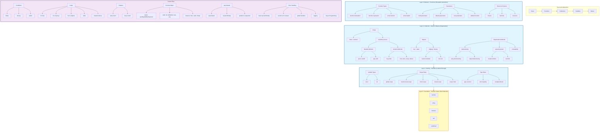

```mermaid
graph TB

    %% Top-Level Abstraction Hierarchy
    subgraph TopLevel["Top-Level Abstraction"]
        Class["Class"]
        Functions["Functions"]
        Collections["Collections"]
        Variables["Variables"]
        Values["Values"]

        Class --> Functions
        Functions --> Collections
        Collections --> Variables
        Variables --> Values
    end

    %% Layer 3: Functions
    subgraph Layer3["Layer 3: Behavior - Functions (Reusable Instructions)"]
        direction TB
        F1["Function Types"]
        F2["Parameters"]
        F3["Return & Closures"]

        FT1["function declaration"]
        FT2["function expression"]
        FT3["arrow function"]
        FT4["arrow implicit"]

        FP1["multi parameters"]
        FP2["default parameters"]
        FP3["rest parameters"]
        FP4["callback function"]

        FR1["closure"]
        FR2["factories"]
        FR3["recursive"]

        F1 --> FT1 & FT2 & FT3 & FT4
        F2 --> FP1 & FP2 & FP3 & FP4
        F3 --> FR1 & FR2 & FR3
    end

    %% Layer 2: Collections
    subgraph Layer2["Layer 2: Collection - Arrays & Objects (Organization)"]
        direction TB
        C1["Arrays"]
        C2["Objects"]
        C3["Organization Methods"]

        %% Arrays
        AI1["index + element"]
        AI2["arr[index] access"]
        AM1["Mutable Methods"]
        AM2["Iteration Methods"]

        AMM1["push, unshift"]
        AMM2["pop, shift"]
        AMI1["map, filter"]
        AMI2["find, some, every, reduce"]

        C1 --> AI1 & AI2
        AI2 --> AM1 & AM2
        AM1 --> AMM1 & AMM2
        AM2 --> AMI1 & AMI2

        %% Objects
        OP1["key + value"]
        OP2["obj[key] / obj.key"]
        OM["custom methods"]
        OR["this rule"]

        C2 --> OP1 & OP2
        OP2 --> OM & OR

        %% Organization
        OM1["destructuring"]
        OM2["spread operator"]
        OM3["immutability"]

        OD1["array destructuring"]
        OD2["object destructuring"]
        OS1["create/combine"]
        OS2["override"]

        C3 --> OM1 & OM2 & OM3
        OM1 --> OD1 & OD2
        OM2 --> OS1 & OS2
    end

    %% Layer 1: Variables
    subgraph Layer1["Layer 1: Naming - Variables (Labeled Storage)"]
        direction TB
        V1["Variable Types"]
        V2["Scope Rules"]
        V3["Type Rules"]

        VT1["const"]
        VT2["let"]

        VS1["global scope"]
        VS2["function-local scope"]
        VS3["block scope"]
        VS4["lexical scope"]
        VS5["scope chain"]

        VR1["type coercion"]
        VR2["strict equality"]
        VR3["template literals"]

        V1 --> VT1 & VT2
        V2 --> VS1 & VS2 & VS3 & VS4 & VS5
        V3 --> VR1 & VR2 & VR3
    end

    %% Layer 0: Primitive Values
    subgraph Layer0["Layer 0: Foundation - Primitive Values (Raw Materials)"]
        direction LR
        PR1["number"]
        PR2["string"]
        PR3["boolean"]
        PR4["null"]
        PR5["undefined"]
    end

    %% Control Flow
    subgraph ControlFlow["Control Flow"]
        direction TB
        CF1["Conditions"]
        CF2["Loops"]
        CF3["Patterns"]
        CF4["Async Programming"]

        %% Conditions
        CND1["if/else"]
        CND2["ternary"]
        CND3["switch"]

        CF1 --> CND1 & CND2 & CND3

        %% Loops
        LP1["for loop"]
        LP2["for-of (array)"]
        LP3["for-in (object)"]
        LP4["while"]
        LP5["break/continue"]

        CF2 --> LP1 & LP2 & LP3 & LP4 & LP5

        %% Patterns
        PT1["early return"]
        PT2["loop control"]

        CF3 --> PT1 & PT2

        %% Async
        AS1["Promise Object"]
        AS2["async/await"]
        AS3["Error Handling"]

        %% Promise
        PS1["states: pending/fulfilled/rejected"]
        PS2["static: all, allSettled, race, any"]
        PS3["instance: then, catch, finally"]

        AS1 --> PS1 & PS2 & PS3

        %% Async
        AW1["async/await"]
        AW2["try/catch/finally"]
        AW3["parallel vs sequential"]

        AS2 --> AW1 & AW2 & AW3

        %% Error Handling
        EH1["basic try/catch/finally"]
        EH2["custom error classes"]
        EH3["global handlers"]
        EH4["logging"]

        AS3 --> EH1 & EH2 & EH3 & EH4
    end

    %% Layer Connections
    Layer3 --> Layer2
    Layer2 --> Layer1
    Layer1 --> Layer0

    %% Style
    classDef layerStyle fill:#e1f5fe,stroke:#01579b,stroke-width:2px
    classDef controlStyle fill:#f3e5f5,stroke:#4a148c,stroke-width:2px
    classDef primitiveStyle fill:#fff9c4,stroke:#f57f17,stroke-width:2px

    class Layer3,Layer2,Layer1 layerStyle
    class ControlFlow controlStyle
    class Layer0 primitiveStyle
```
